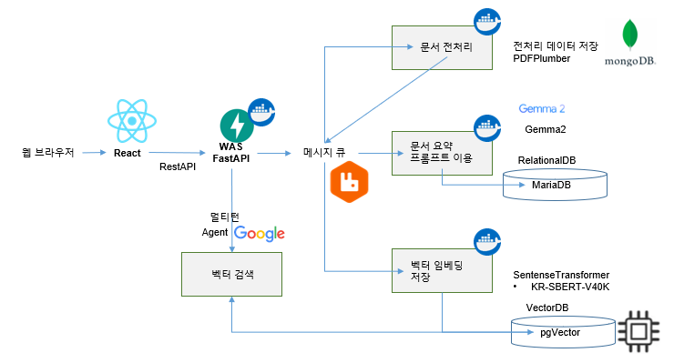
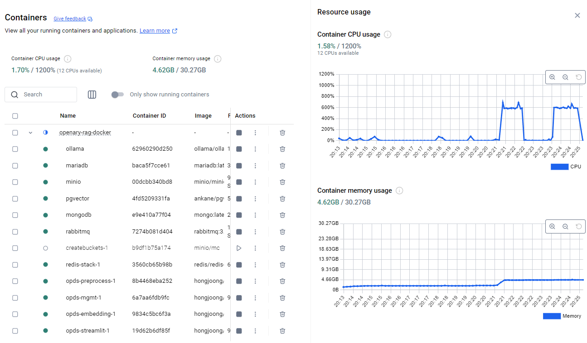
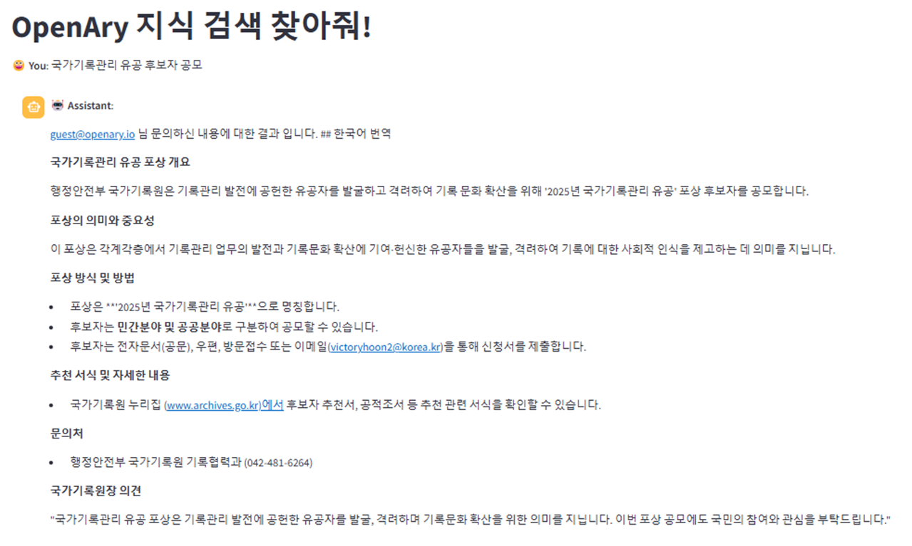

# OpenAry Rag Docker for Your PC

#### RAG에 꼭 고사양의 PC가 필요하진 않습니다.

#### 물론 GPU가 있어면 빠릅니다.

#### 하지만 요즘 3D 게임 즐길 CPU 사양이면, 노트북이나 데스크탑에서도 되요..

### 구조는 이렇게 되어 있어요...



#### 자원은 이정도로 쓰네요?



### 예제 화면 이에요.



## 이렇게 동작 시키면 되요

#### 이 레파지토리를 다운로드 받으세요

```commandline
git clone https://github.com/theprismdata/openary-rag-docker-compose.git
```

#### config/svc-set.yaml 의 openai apikey를 등록합니다.

```commandline
문서 일부 요약과 Agent에 들어가는 키워드 이외에는 GPT를 사용하지 않으니 큰 비용이 요구되지 않습니다.
```

```commandline
langmodel:
  activemode: ollama

  openai:
    apikey: "Your API KEY"
    chat_model: "gpt-4o"
  ollama:
    address: "http://ollama:11434"
    chat_model: "gemma2:2b"
```

#### ollama chat 모델을 바꾸시고 싶으시면 모델명만 바꾸시고 컨테이너를 다시 실행 시키시면 자동으로 다운로드 받아요.

#### Docker Desktop을 설치후 다음의 명령을 수행합니다.

```commandline
docker-compose -f .\docker-compose.yaml up -d
```

```
debug시
docker-compose -f .\docker-compose.web.dev.yaml up -d

nginx.exe  -c E:\\1.1.nginx\\conf\\nginx.conf -p E:\\1.1.nginx
```

```commandline
문서 임베딩, LLM과의 대화는 ollama gemma2 컨테이너에서 수행해 줍니다
```

주요 서비스 주소

### 사용자 관리 DOC API

http://localhost:9001/api-docs

### 대화 관리 DOC API

- http://localhost:9000/api/docs
- ### Streamlit을 이용한 지식 조회
- http://localhost:9002
-

### Rabbitmq 관리 대시보드

ID : genai
PASSWORD : openary
http://localhost:15672/

세부 사항은 openary-howto.pdf를 참조하세요<br>
[openary-howto.pdf](short_doc/openary-howto.pdf)
