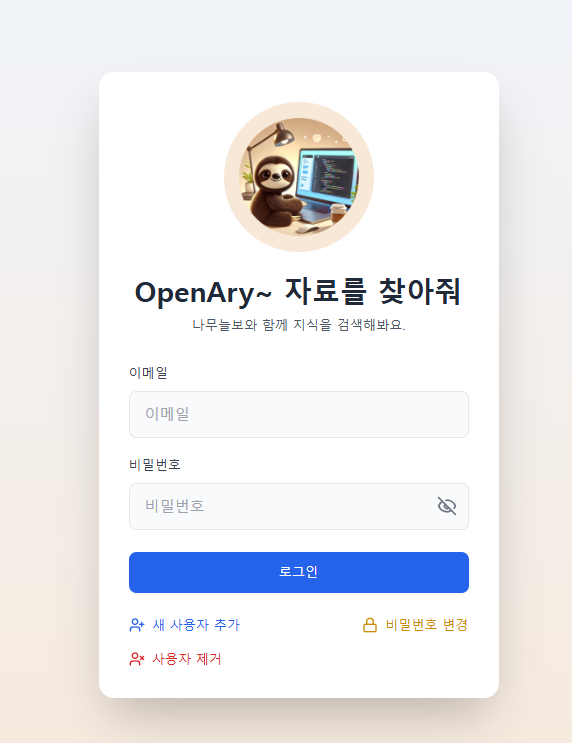
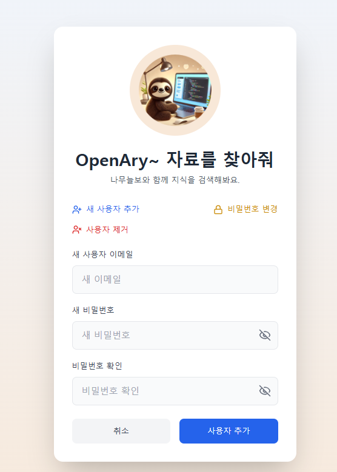
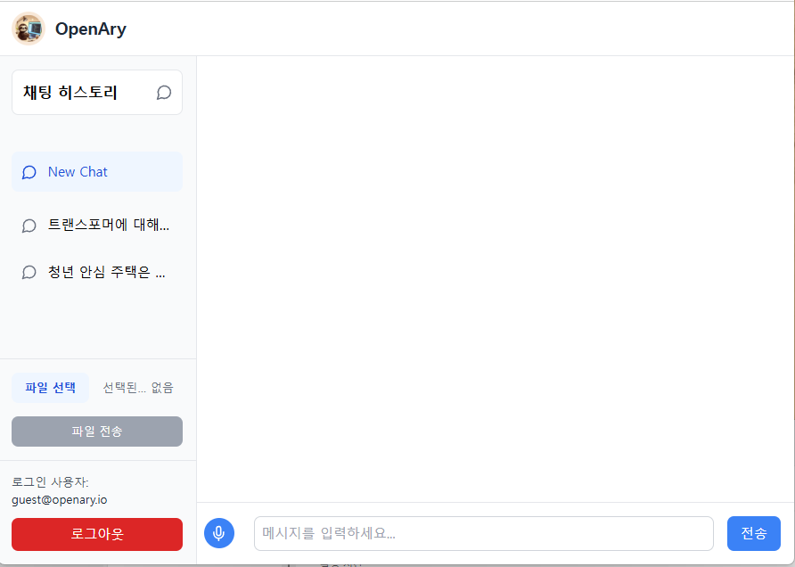
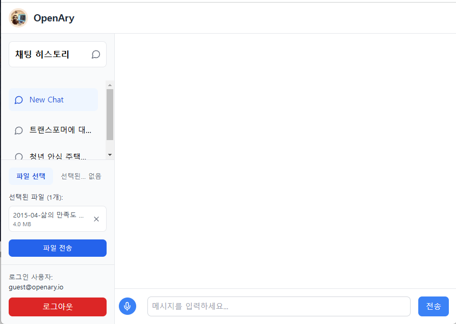
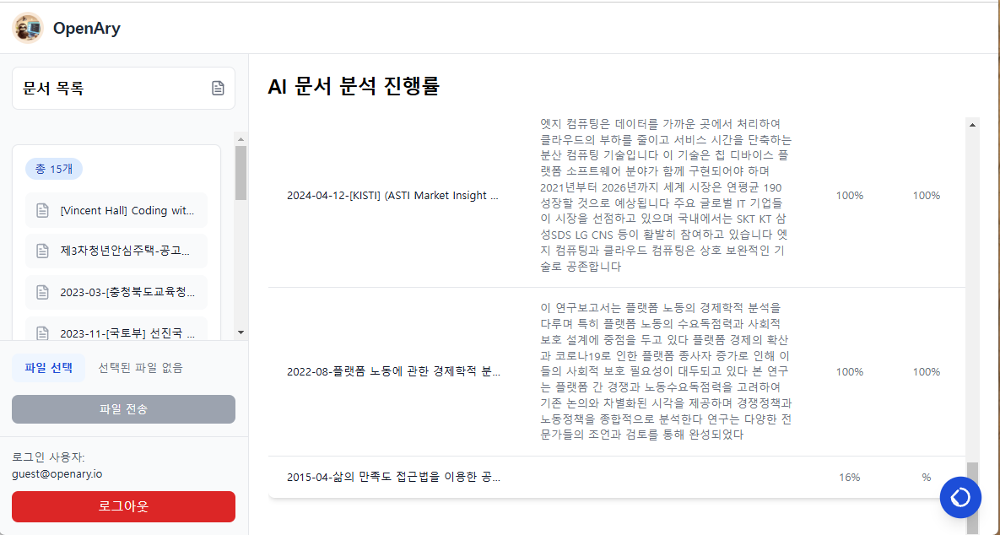
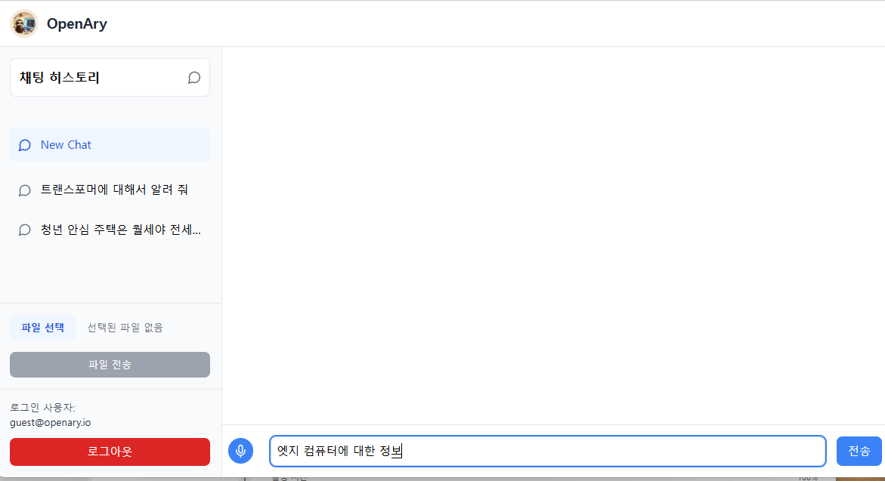
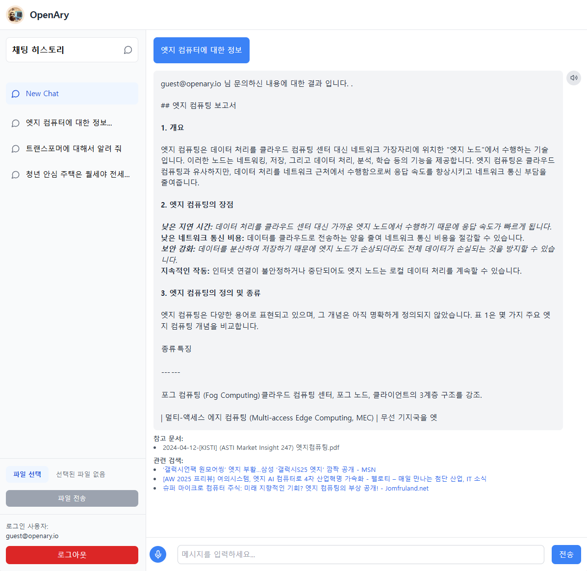

# OpenAry Rag Docker for Your PC

#### RAG에 꼭 고사양의 PC가 필요하진 않습니다.

#### 물론 GPU가 있어면 빠릅니다.

#### 하지만 요즘 3D 게임 즐길 CPU 사양이면, 노트북이나 데스크탑에서도 되요..

### 구조는 이렇게 되어 있어요...


#### 자원은 이정도로 쓰네요?


## 이렇게 동작 시키면 되요

#### 이 레파지토리를 다운로드 받으세요

```commandline
git clone https://github.com/theprismdata/openary-rag-docker-compose.git
```

#### config/svc-set.yaml 의 openai apikey를 등록합니다.

```commandline
문서 일부 요약과 Agent에 들어가는 키워드 이외에는 GPT를 사용하지 않으니 큰 비용이 요구되지 않습니다.
```

```commandline
langmodel:
  activemode: ollama

  openai:
    apikey: "Your API KEY"
    chat_model: "gpt-4o"
  ollama:
    address: "http://ollama:11434"
    chat_model: "gemma2:2b"

  huggingface:
    model: "google/gemma-2-9b-it"
    api_key: "Your Hugginface API KEY"
```

#### ollama chat 모델을 바꾸시고 싶으시면 모델명만 바꾸시고 컨테이너를 다시 실행 시키시면 자동으로 다운로드 받아요.

#### Docker Desktop을 설치후 다음의 명령을 수행합니다.

```commandline
docker-compose -f .\docker-compose.yaml up -d
```

````
WEB 디버그시
localhost에서 nginx 실행
nginx의 nginx.conf는 nginx/nginx.local.dev.conf를 활용
nginx 실행 (E:\1.1.nginx 에 nginx가 있을 경우)
이때. nginx\의 nginx.local.dev.conf를 E:\1.1.nginx\nginx\conf\nginx.conf에 overwrite하여 다음 명령을 수행합니다.
E:\1.1.nginx> .\nginx.exe

docker-compose -f .\docker-compose.dev.noweb.yaml up -d

CHATAPI 디버그용
docker-compose -f .\docker-compose.dev.nochatapi up -d

전체 디버깅용 (개발 설정 포함)
docker-compose -f .\docker-compose.dev.yaml up -d

```commandline
문서 임베딩, LLM과의 대화는 ollama gemma2 컨테이너에서 수행해 줍니다
````

정상적으로 모든 컨테이너가 생성되면 Localhost로 접속하면 되요.

```
chatapp\npm run windev
```

- login <br>

# 

- 사용자 추가

# 

- LLM 프롬프트 및 전체

# 

- 파일 등록

# 

- 문서 분석

# 

- 프롬프트 실행

# 

- LLM 답변 보기기

# 

## 주요 서비스 주소

### 사용자 관리 DOC API

- http://localhost:9001/api-docs

### 대화 관리 DOC API

- http://localhost:9000/api/docs

### Rabbitmq 관리 대시보드

ID : genai
PASSWORD : openary

- http://localhost:15672/

### Live Demo

- http://openary.io/chat
